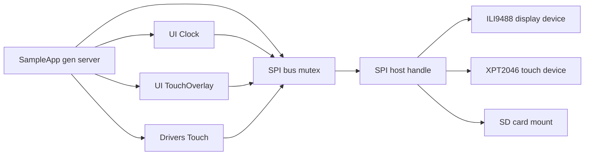

# Hello AtomVM LCD SPI Example

A tiny Elixir/AtomVM demo for the ESP32 featuring:

- A 480×320 ILI9488 LCD driven over SPI
- FAT-formatted SD card support with automatic image loading
- A lightweight HH:MM:SS clock overlay
- Resistive touch input via XPT2046/ADS7846
  - A small on-screen cursor box
  - An `xxx:yyy` coordinate readout near the bottom


---

## Quickstart

```sh
# Clone this example AtomVM project
git clone https://github.com/piyopiyoex/hello_atomvm_lcd_spi.git

# Enter the project directory
cd hello_atomvm_lcd_spi

# Fetch Elixir dependencies
mix deps.get

# Flash the AtomVM runtime to your ESP32 (one-time setup)
mix atomvm.esp32.install

# Select board revision (affects CS wiring; see "Hardware Overview")
export PIYOPIYO_BOARD=v1.6

# Build and flash the application firmware to the device
mix do clean + atomvm.esp32.flash --port /dev/ttyACM0

# Open a serial monitor to view runtime logs
picocom /dev/ttyACM0
```

---

## Architecture

This app shares a single physical SPI bus across multiple devices (LCD, touch controller, SD card). To prevent corrupted transfers, multi-step SPI sequences are serialized through `SampleApp.Buses.SPI.transaction/2`.



---

## Boot sequence (high level)

1. Start SPI bus owner (`SampleApp.Buses.SPI`)
2. Initialize Display and draw sanity bars
3. Mount `/sdcard` (FAT)
4. Find the first `.RGB`, validate its byte size, and stream it to the Display
   - If no `.RGB` files are found, fall back to `priv/default.rgb`
   - If mounting fails, also fall back to `priv/default.rgb`
5. Start `UI.Clock` (HH:MM:SS)
6. Start `UI.TouchOverlay` (cursor + `xxx:yyy`)
7. Start `Drivers.Touch` (sends `{:touch, x, y, z}` and `{:touch_up, x, y}`)

---

## Hardware Overview

This project uses a custom breakout board designed for the XIAO-ESP32S3, with connectors for:

- ILI9488 LCD
- XPT2046/ADS7846 touch controller
- SD card (shared SPI bus)

All hardware-related materials are maintained in a dedicated repository:

- [piyopiyoex/piyopiyo-pcb](https://github.com/piyopiyoex/piyopiyo-pcb)

The firmware supports the following board revisions:

- **v1.5 or lower** — original wiring
- **v1.6 or higher** — same board, except Display-CS and SDCard-CS are swapped

<p align="center">
  
</p>

---

## Wiring

Base wiring for **v1.5 (and lower)**:

| Function    | XIAO-ESP32S3 pin | ESP32-S3 GPIO |
| ----------- | ---------------- | ------------- |
| SCLK        | D8               | 7             |
| MISO        | D9               | 8             |
| MOSI        | D10              | 9             |
| Display CS  | —                | 43            |
| Touch CS    | —                | 44            |
| Display D/C | D2               | 3             |
| Display RST | D1               | 2             |
| SDCard CS   | D3               | 4             |

For **v1.6 (and higher)**, these two signals swap:

- Display CS → GPIO4
- SDCard CS → GPIO43

Notes:

- Display D/C and RESET are panel control pins (not SPI CS).
- Touch CS is configured as an SPI device CS (via `:spi_dev_touch`).

---

## `.RGB` Images

- Raw RGB888 bytes (no header), top-left origin
- Exact size: **480 × 320 × 3 = 460,800 bytes**
- Place files at the SD card root (e.g. `/sdcard/foo.RGB`)
- The app picks the first `.RGB` file (sorted)
  - If none are found, it falls back to `priv/default.rgb`
  - If SD mount fails, it falls back to `priv/default.rgb`
