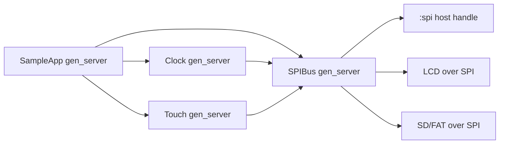

# Hello AtomVM LCD SPI Example

A tiny Elixir/AtomVM demo for the ESP32 featuring:

- A 480×320 ILI9488 LCD driven over SPI
- FAT-formatted SD card support with automatic image loading
- A lightweight HH:MM:SS clock overlay
- Resistive touch input via XPT2046/ADS7846 (with a small on-screen cursor + `x:y` readout)

<p align="center">
  
</p>

---

## Architecture

This app shares a single physical SPI bus across multiple “devices” (LCD, touch controller, SD card). To avoid corrupted transfers, all multi-step SPI sequences are serialized by `SampleApp.SPIBus`.



---

## Quickstart

```sh
# Clone this example AtomVM project
git clone https://github.com/piyopiyoex/hello_atomvm_lcd_spi.git

# Enter the project directory
cd hello_atomvm_lcd_spi

# Fetch Elixir dependencies
mix deps.get

# Flash the AtomVM runtime to your ESP32 (one-time setup)
mix atomvm.esp32.install

# Select board revision (default: v1.6)
export PIYOPIYO_BOARD=v1.5

# Build and flash the application firmware to the device
mix do clean + atomvm.esp32.flash --port /dev/ttyACM0

# Open a serial monitor to view runtime logs
picocom /dev/ttyACM0
```

---

## Hardware Overview

This project uses a **custom breakout board** designed for the XIAO-ESP32S3, with connectors for:

- ILI9488 LCD
- XPT2046/ADS7846 touch controller
- SD card (shared SPI bus)

All hardware-related materials are maintained in a dedicated repository:

- [piyopiyoex/piyopiyo-pcb](https://github.com/piyopiyoex/piyopiyo-pcb)

For board assembly, pinout verification, or revision-specific details, the PCB repository should be treated as the authoritative source.

The firmware supports the following board revisions:

- **v1.5 or lower** — original wiring
- **v1.6 or higher** — same board, except LCD-CS and SD-CS are swapped

These are the boards shown in the photos below.

<p align="center">
  
</p>

---

## Wiring

Base wiring for **v1.5 (and lower)**:

| Function | XIAO-ESP32S3 pin | ESP32-S3 GPIO |
| -------- | ---------------- | ------------- |
| SCLK     | D8               | 7             |
| MISO     | D9               | 8             |
| MOSI     | D10              | 9             |
| LCD CS   | —                | 43            |
| Touch CS | —                | 44            |
| LCD D/C  | D2               | 3             |
| LCD RST  | D1               | 2             |
| SD CS    | D3               | 4             |

For **v1.6 (and higher)**, these two swap:

- **LCD CS → GPIO4**
- **SD CS → GPIO43**

---

## `.RGB` Images

- Raw RGB888 (no header), top-left origin
- Exact size: **480 × 320 × 3 = 460,800 bytes**
- Place files at the SD card root
- If no `.RGB` files are found, the app falls back to `priv/default.rgb`
